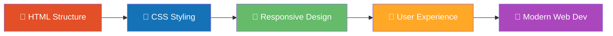

<div align="center">

# 🎨 HTML & CSS Projects Playground

### *Mastering the Building Blocks of the Web*

[](https://developer.mozilla.org/en-US/docs/Web/HTML)
[](https://developer.mozilla.org/en-US/docs/Web/CSS)

> **A curated collection of frontend experiments, college assignments, and structured learning projects.**  
> Built from scratch to understand core fundamentals before diving into frameworks.

</div>

---

## 📑 Table of Contents

- [🚀 FreeCodeCamp Projects](#-freecodecamp-projects)
- [🏅 Certification Projects](#-certification-projects)
- [🎓 College Projects](#-college-projects)
- [🛠️ Technologies Used](#️-technologies-used)
- [📚 Learning Outcomes](#-learning-outcomes)

---

## 🏅 Certification Projects

<details open>
<summary><b>📋 01 - Survey Form (FCC)</b></summary>

Responsive survey form built for the FreeCodeCamp certification milestone.
- **Tech**: HTML5, CSS3
- **Concepts**: Form semantics, input validation, layout structure
- 📄 [View Project](./Certifications-Project/01_SurveyForm)

</details>

---

## 🎓 College Projects

<details open>
<summary><b>📰 BBC News Basics</b></summary>

A news website clone practicing semantic HTML structure and basic styling.
- **Tech**: HTML5
- **Concepts**: Semantic elements, article layouts, navigation
- 📄 [View Project](./College_Projects/BBC%20News%20Basics)

</details>

<details open>
<summary><b>🏫 College Curriculum</b></summary>

Interactive display of college semester lists with structured data presentation.
- **Tech**: HTML5
- **Concepts**: Tables, lists, information hierarchy
- 📄 [View Project](./College_Projects/College%20Curriculum)

</details>

<details open>
<summary><b>🛒 Ecommerce Website</b></summary>

Basic e-commerce site layout with product displays and CSS styling.
- **Tech**: HTML5, CSS3
- **Concepts**: Layouts, responsive design, external stylesheets
- 📄 [View Project](./College_Projects/Ecommerce%20Website)

</details>

<details open>
<summary><b>🏨 Hotel Booking Form</b></summary>

Interactive booking form with form validation and response handling.
- **Tech**: HTML5
- **Concepts**: Forms, input types, validation, form submission
- 📄 [View Project](./College_Projects/Hotel%20Booking%20Form)

</details>

<details open>
<summary><b>🧭 Navbar with CSS</b></summary>

Stylish navigation bar built with modern CSS techniques.
- **Tech**: HTML5, CSS3
- **Concepts**: Flexbox, positioning, hover effects, styling
- 📄 [View Project](./College_Projects/Navbar%20with%20CSS)

</details>

<details open>
<summary><b>🃏 Profile Cards</b></summary>

Elegant profile card components showcasing CSS layout skills.
- **Tech**: HTML5, CSS3
- **Concepts**: Card layouts, flexbox/grid, shadows, borders
- 📄 [View Project](./College_Projects/Profile%20Cards)

</details>

<details open>
<summary><b>📊 Tables HTML</b></summary>

Comprehensive table creation and styling practice.
- **Tech**: HTML5
- **Concepts**: Table structure, data organization, accessibility
- 📄 [View Project](./College_Projects/Tables%20HTML)

</details>

---

## 🚀 FreeCodeCamp Projects

<div align="center">

### ✨ *Structured Learning from FreeCodeCamp's Responsive Web Design Certification* ✨

</div>

### 🐱 01 - Cat Photo App

<table>
<tr>
<td width="70%">

**The Foundation Project**

A beginner-friendly project introducing HTML basics through building a cat photo application.

**Key Learning Points:**
- Basic HTML elements (`<h1>`, `<p>`, ``, `<a>`)
- Lists (ordered and unordered)
- Forms and input elements
- Link and image attributes
- Semantic HTML structure

</td>
<td width="30%" align="center">

```
    /\_/\
   ( o.o )
    > ^ <
  🐾 HTML 🐾
```

**Status:** ✅ Complete

📁 [View Code](./Projects-FreeCodeCamp/01_Cat-Photo-App)

</td>
</tr>
</table>

---

### ☕ 02 - Cafe Menu

<table>
<tr>
<td width="70%">

**Styling with CSS**

A stylish cafe menu demonstrating CSS fundamentals and design principles.

**Key Learning Points:**
- External CSS stylesheets
- CSS selectors and specificity
- Typography and font styling
- Colors and backgrounds
- Box model (padding, margin, border)
- Class and ID selectors

</td>
<td width="30%" align="center">

```
    )  (
   (   ) )
    |___|
    |   |
  ☕ CSS ☕
```

**Status:** ✅ Complete

📁 [View Code](./Projects-FreeCodeCamp/02_Cafe-Menu)

</td>
</tr>
</table>

---

### 🖍️ 03 - Set of Color Markers

<table>
<tr>
<td width="70%">

**Color and Gradient Practice**

A creative project focused on CSS color systems and visual effects.

**Key Learning Points:**
- Linear gradients and smooth color transitions
- Box-shadow for glow effects
- Color formats: `rgb`, `rgba`, `hsl`, and hex
- Inline-block layout alignment

</td>
<td width="30%" align="center">

```
  |\
  | \
  |  \
  |___\
  🖍️ CSS 🖍️
```

**Status:** ✅ Complete

📁 [View Code](./Projects-FreeCodeCamp/03_Set_of_Color_Markers)

</td>
</tr>
</table>

---

### 📝 04 - Building a Registration Form

<table>
<tr>
<td width="70%">

**Form Structure and Validation**

A practical project focused on building accessible forms with HTML constraints and clean, reusable CSS.

**Key Learning Points:**
- Field grouping with `<fieldset>` and `<legend>`
- Validation patterns with `required`, `min`, `max`, and `pattern`
- Radio/checkbox behavior using shared `name`
- Select and textarea controls with meaningful `value` attributes
- Attribute selectors like `input[type="submit"]`

</td>
<td width="30%" align="center">

```
  ________
 |  FORM  |
 |  ____  |
 | |____| |
 |________|
  📝 HTML 📝
```

**Status:** ✅ Complete

📁 [View Code](./Projects-FreeCodeCamp/04_Building_Registration_Form)

</td>
</tr>
</table>

---

### 🎨 05 - Rothko Painting

<table>
<tr>
<td width="70%">

**Abstract Art with CSS**

A tribute to Mark Rothko's minimalist style, exploring advanced CSS visual effects to create soft, layered abstract artwork.

**Key Learning Points:**
- **Filter property** with `blur()` for soft visual effects
- **Box-shadow syntax** with offset, blur, spread, and color for glowing halos
- **Border-radius with 4 values** (clockwise from top-left) for organic shapes
- **Transform: rotate** with subtle angles for natural, hand-painted feel
- Combining multiple effects to achieve artistic depth
- Overflow control for contained compositions

</td>
<td width="30%" align="center">

```
  ┌─────────┐
  │░░░░░░░░░│
  │▒▒▒▒▒▒▒▒▒│
  │▓▓▓▓▓▓▓▓▓│
  └─────────┘
  🎨 CSS 🎨
```

**Status:** ✅ Complete

📁 [View Code](./Projects-FreeCodeCamp/05_Rothko_Painting)

</td>
</tr>
</table>

---

## 🛠️ Technologies Used

<table>
<tr>
<td align="center" width="50%">

### 🌐 HTML5

- Semantic Elements
- Forms & Validation
- Accessibility Features
- Structured Data
- Media Embedding

</td>
<td align="center" width="50%">

### 🎨 CSS3

- Flexbox & Grid
- Responsive Design
- Animations & Transitions
- Custom Properties
- Modern Selectors

</td>
</tr>
</table>

---

## 📚 Learning Outcomes



---

<div align="center">
    
### 🎯 Core Skills Developed

| Skill Area | Technologies | Proficiency |
|:-----------|:-------------|:------------|
| **Markup** | HTML5, Semantic Elements | ⭐⭐⭐⭐⭐ |
| **Styling** | CSS3, Flexbox, Grid | ⭐⭐⭐⭐⭐ |
| **Forms** | Input Types, Validation, Accessibility | ⭐⭐⭐⭐⭐ |
| **Layout** | Responsive Design | ⭐⭐⭐⭐ |
| **UI/UX** | Design Principles | ⭐⭐⭐⭐ |

</div>

---

<div align="center">

### 💡 Philosophy

*"Every expert was once a beginner. These projects represent the journey of mastering web fundamentals—one line of code at a time."*

---

### 🔗 Connect & Learn More

[]()
[](https://github.com/VedisVigourous)
[]()

---

**⭐ Star this repository if you find it helpful!**

*Last Updated: February 2026*

</div>
