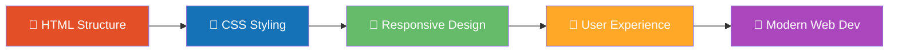

<div align="center">

# 🎨 HTML & CSS Projects Playground

### *Mastering the Building Blocks of the Web*

[](https://developer.mozilla.org/en-US/docs/Web/HTML)
[](https://developer.mozilla.org/en-US/docs/Web/CSS)

> **A curated collection of frontend experiments, college assignments, and structured learning projects.**  
> Built from scratch to understand core fundamentals before diving into frameworks.

</div>

---

## 📑 Table of Contents

- [🚀 FreeCodeCamp Projects](#-freecodecamp-projects)
- [🏅 Certification Projects](#-certification-projects)
- [🎓 College Projects](#-college-projects)
- [🛠️ Technologies Used](#️-technologies-used)
- [📚 Learning Outcomes](#-learning-outcomes)

---

## 🏅 Certification Projects

<details open>
<summary><b>📋 01 - Survey Form (FCC)</b></summary>

Responsive survey form built for the FreeCodeCamp certification milestone.
- **Tech**: HTML5, CSS3
- **Concepts**: Form semantics, input validation, layout structure
- 📄 [View Project](./Certifications-Project/01_SurveyForm)

</details>

<details open>
<summary><b>🏆 02 - Tribute Page (FCC)</b></summary>

A tribute page dedicated to celebrating an influential figure, built for the FreeCodeCamp certification.
- **Tech**: HTML5, CSS3
- **Concepts**: Responsive layouts, typography, image handling, content structure
- 📄 [View Project](./Certifications-Project/02_TributePage)

</details>

---

## 🎓 College Projects

<details open>
<summary><strong> College Projects </strong></summary>

<details open>
<summary><b>📰 BBC News Basics</b></summary>

A news website clone practicing semantic HTML structure and basic styling.
- **Tech**: HTML5
- **Concepts**: Semantic elements, article layouts, navigation
- 📄 [View Project](./College_Projects/BBC%20News%20Basics)

</details>

<details open>
<summary><b>🏫 College Curriculum</b></summary>

Interactive display of college semester lists with structured data presentation.
- **Tech**: HTML5
- **Concepts**: Tables, lists, information hierarchy
- 📄 [View Project](./College_Projects/College%20Curriculum)

</details>

<details open>
<summary><b>🛒 Ecommerce Website</b></summary>

Basic e-commerce site layout with product displays and CSS styling.
- **Tech**: HTML5, CSS3
- **Concepts**: Layouts, responsive design, external stylesheets
- 📄 [View Project](./College_Projects/Ecommerce%20Website)

</details>

<details open>
<summary><b>🏨 Hotel Booking Form</b></summary>

Interactive booking form with form validation and response handling.
- **Tech**: HTML5
- **Concepts**: Forms, input types, validation, form submission
- 📄 [View Project](./College_Projects/Hotel%20Booking%20Form)

</details>

<details open>
<summary><b>🧭 Navbar with CSS</b></summary>

Stylish navigation bar built with modern CSS techniques.
- **Tech**: HTML5, CSS3
- **Concepts**: Flexbox, positioning, hover effects, styling
- 📄 [View Project](./College_Projects/Navbar%20with%20CSS)

</details>

<details open>
<summary><b>🃏 Profile Cards</b></summary>

Elegant profile card components showcasing CSS layout skills.
- **Tech**: HTML5, CSS3
- **Concepts**: Card layouts, flexbox/grid, shadows, borders
- 📄 [View Project](./College_Projects/Profile%20Cards)

</details>

<details open>
<summary><b>📊 Tables HTML</b></summary>

Comprehensive table creation and styling practice.
- **Tech**: HTML5
- **Concepts**: Table structure, data organization, accessibility
- 📄 [View Project](./College_Projects/Tables%20HTML)

</details>

</details>

---

## 🚀 FreeCodeCamp Projects

<div align="center">

### ✨ *Structured Learning from FreeCodeCamp's Responsive Web Design Certification* ✨

</div>

### 🐱 01 - Cat Photo App

<table>
<tr>
<td width="70%">

**The Foundation Project**

A beginner-friendly project introducing HTML basics through building a cat photo application.

**Key Learning Points:**
- Basic HTML elements (`<h1>`, `<p>`, ``, `<a>`)
- Lists (ordered and unordered)
- Forms and input elements
- Link and image attributes
- Semantic HTML structure

</td>
<td width="30%" align="center">

```
    /\_/\
   ( o.o )
    > ^ <
  🐾 HTML 🐾
```

**Status:** ✅ Complete

📁 [View Code](./Projects-FreeCodeCamp/01_Cat-Photo-App)

</td>
</tr>
</table>

---

### ☕ 02 - Cafe Menu

<table>
<tr>
<td width="70%">

**Styling with CSS**

A stylish cafe menu demonstrating CSS fundamentals and design principles.

**Key Learning Points:**
- External CSS stylesheets
- CSS selectors and specificity
- Typography and font styling
- Colors and backgrounds
- Box model (padding, margin, border)
- Class and ID selectors

</td>
<td width="30%" align="center">

```
    )  (
   (   ) )
    |___|
    |   |
  ☕ CSS ☕
```

**Status:** ✅ Complete

📁 [View Code](./Projects-FreeCodeCamp/02_Cafe-Menu)

</td>
</tr>
</table>

---

### 🖍️ 03 - Set of Color Markers

<table>
<tr>
<td width="70%">

**Color and Gradient Practice**

A creative project focused on CSS color systems and visual effects.

**Key Learning Points:**
- Linear gradients and smooth color transitions
- Box-shadow for glow effects
- Color formats: `rgb`, `rgba`, `hsl`, and hex
- Inline-block layout alignment

</td>
<td width="30%" align="center">

```
  |\
  | \
  |  \
  |___\
  🖍️ CSS 🖍️
```

**Status:** ✅ Complete

📁 [View Code](./Projects-FreeCodeCamp/03_Set_of_Color_Markers)

</td>
</tr>
</table>

---

### 📝 04 - Building a Registration Form

<table>
<tr>
<td width="70%">

**Form Structure and Validation**

A practical project focused on building accessible forms with HTML constraints and clean, reusable CSS.

**Key Learning Points:**
- Field grouping with `<fieldset>` and `<legend>`
- Validation patterns with `required`, `min`, `max`, and `pattern`
- Radio/checkbox behavior using shared `name`
- Select and textarea controls with meaningful `value` attributes
- Attribute selectors like `input[type="submit"]`

</td>
<td width="30%" align="center">

```
  ________
 |  FORM  |
 |  ____  |
 | |____| |
 |________|
  📝 HTML 📝
```

**Status:** ✅ Complete

📁 [View Code](./Projects-FreeCodeCamp/04_Building_Registration_Form)

</td>
</tr>
</table>

---

### 🎨 05 - Rothko Painting

<table>
<tr>
<td width="70%">

**Abstract Art with CSS**

A tribute to Mark Rothko's minimalist style, exploring advanced CSS visual effects to create soft, layered abstract artwork.

**Key Learning Points:**
- **Filter property** with `blur()` for soft visual effects
- **Box-shadow syntax** with offset, blur, spread, and color for glowing halos
- **Border-radius with 4 values** (clockwise from top-left) for organic shapes
- **Transform: rotate** with subtle angles for natural, hand-painted feel
- Combining multiple effects to achieve artistic depth
- Overflow control for contained compositions

</td>
<td width="30%" align="center">

```
  ┌─────────┐
  │░░░░░░░░░│
  │▒▒▒▒▒▒▒▒▒│
  │▓▓▓▓▓▓▓▓▓│
  └─────────┘
  🎨 CSS 🎨
```

**Status:** ✅ Complete

📁 [View Code](./Projects-FreeCodeCamp/05_Rothko_Painting)

</td>
</tr>
</table>

---

### 🖼️ 06 - FlexBox Photo Gallery

<table>
<tr>
<td width="70%">

**Mastering Flexbox Layout**

A responsive photo gallery showcasing the power and flexibility of CSS Flexbox for modern web layouts.

**Key Learning Points:**
- **display: flex** - The foundation of flexible layouts
- **flex-direction** (row, column, reverse) for content flow
- **flex-wrap** for responsive multi-line layouts
- **justify-content** - Main axis alignment (space-between, center, etc.)
- **align-items** - Cross axis alignment
- **object-fit** for image scaling within containers
- **::after pseudo-element** for layout spacing tricks
- **box-sizing: border-box** for predictable dimensions

</td>
<td width="30%" align="center">

```
  ┌─┬─┬─┐
  │ │ │ │
  ├─┼─┼─┤
  │ │ │ │
  └─┴─┴─┘
  🖼️ FLEX 🖼️
```

**Status:** ✅ Complete

📁 [View Code](./Projects-FreeCodeCamp/06_FlexBox_Gallery)

</td>
</tr>
</table>

---

### 🔤 07 - Typography

<table>
<tr>
<td width="70%">

**Typography and Text Styling**

A detailed nutrition label replica that dives deep into CSS typography techniques for precise, readable text layouts.

**Key Learning Points:**
- **Google Fonts** import and usage with multiple weights (400, 700, 800)
- **letter-spacing** for fine-tuned character spacing
- **text-indent** and **hanging indents** for footnote-style text
- **rem/em units** for scalable, font-relative sizing
- **Flexbox** for label row alignment (`justify-content: space-between`)
- **:not() pseudo-class** selector for conditional styling
- **font-weight** values (800 = extra bold) for visual hierarchy
- **border-bottom** dividers for structured information display

</td>
<td width="30%" align="center">

```
  ┌──────────┐
  │Nutrition │
  │  Facts   │
  │──────────│
  │Calories  │
  │    230   │
  └──────────┘
  🔤 CSS 🔤
```

**Status:** ✅ Complete

📁 [View Code](./Projects-FreeCodeCamp/07_Typography)

</td>
</tr>
</table>

---

### ♿ 08 - Accessibility

<table>
<tr>
<td width="70%">

**Building for Everyone**

An HTML/CSS quiz page built with a strong focus on web accessibility — ensuring the site works for all users including those using screen readers and assistive technologies.

**Key Learning Points:**
- **ARIA roles** (`role="region"`, `role="img"`) to give semantic meaning to elements
- **aria-labelledby** to link sections to their headings for screen readers
- **`<footer>` & `<address>`** semantic tags for contact info landmarks
- **`.sr-only` class** — visually hides text but keeps it readable by screen readers
- **`::before` pseudo-element** with `content` to inject labels via CSS
- **`@media (prefers-reduced-motion)`** for motion-sensitive users with `scroll-behavior: smooth`
- **`padding-inline-start` & `margin-block`** — modern logical CSS spacing properties
- **`aspect-ratio`** for maintaining proportional element dimensions

</td>
<td width="30%" align="center">

```
  ┌──────────┐
  │  ♿ A11Y │
  │  ──────  │
  │ ◉ Yes   │
  │ ○ No    │
  └──────────┘
  ♿ ACCESS ♿
```

**Status:** ✅ Complete

📁 [View Code](./Projects-FreeCodeCamp/08_Accesibility)

</td>
</tr>
</table>

---

### 🎯 09 - Pseudo Selectors

<table>
<tr>
<td width="70%">

**Smarter Targeting with CSS Selectors**

A balance-sheet project focused on practical pseudo-selector usage, selector behavior, and screen-reader-friendly hidden text patterns.

**Key Learning Points:**
- **`:first-of-type`** and **`:last-of-type`** to style first/last matching sibling elements
- **`:nth-of-type(3)`** for targeting a specific sibling position
- **`:hover`** for interactive row highlighting
- **`span[class~="sr-only"]`** to visually hide text while keeping it available to screen readers
- Clear understanding of selector differences: **`tag.class`** vs **`tag[class="exact"]`** vs **`tag[class~="word"]`**
- In-file comment notes in `styles.css` documenting each `sr-only` declaration line-by-line

</td>
<td width="30%" align="center">

```
  ┌────────────┐
  │ :hover     │
  │ :nth-of... │
  │ sr-only    │
  └────────────┘
  🎯 CSS 🎯
```

**Status:** ✅ Complete

📁 [View Code](./Projects-FreeCodeCamp/09_PseudoSelectors)

</td>
</tr>
</table>

---

### 📌 10 - CSS Positioning

<table>
<tr>
<td width="70%">

**Precise Placement with CSS Positioning**

A project focused on controlling element placement and layering to build a structured cat illustration.

**Key Learning Points:**
- **position values**: `static`, `relative`, `absolute`, `fixed`, `sticky`
- **offset properties**: `top`, `right`, `bottom`, `left`
- **z-index** for stacking and overlap control
- **transform** functions like `rotate()` and `translate()`
- **border-radius** corner control for custom shapes
- **CSS triangle technique** using transparent borders

</td>
<td width="30%" align="center">

```
  ┌──────────┐
  │  top:0   │
  │ left:0   │
  │ z: 10    │
  └──────────┘
  📌 CSS 📌
```

**Status:** ✅ Complete

📁 [View Code](./Projects-FreeCodeCamp/10_CSS-Positioning)

</td>
</tr>
</table>

---

## 🛠️ Technologies Used

<table>
<tr>
<td align="center" width="50%">

### 🌐 HTML5

- Semantic Elements
- Forms & Validation
- Accessibility Features
- Structured Data
- Media Embedding

</td>
<td align="center" width="50%">

### 🎨 CSS3

- Flexbox & Grid
- Responsive Design
- Animations & Transitions
- Custom Properties
- Modern Selectors

</td>
</tr>
</table>

---

## 📚 Learning Outcomes


```mermaid
graph LR
    A[📝 HTML Structure] --> B[🎨 CSS Styling]
    B --> C[📱 Responsive Design]
    C --> D[🎯 User Experience]
    D --> E[🚀 Modern Web Dev]
    
    style A fill:#E34F26,color:#fff
    style B fill:#1572B6,color:#fff
    style C fill:#66BB6A,color:#fff
    style D fill:#FFA726,color:#fff
    style E fill:#AB47BC,color:#fff
```

---

<div align="center">
    
### 🎯 Core Skills Developed

| Skill Area | Technologies | Proficiency |
|:-----------|:-------------|:------------|
| **Markup** | HTML5, Semantic Elements | ⭐⭐⭐⭐⭐ |
| **Styling** | CSS3, Flexbox, Grid | ⭐⭐⭐⭐⭐ |
| **Forms** | Input Types, Validation, Accessibility | ⭐⭐⭐⭐⭐ |
| **Layout** | Responsive Design | ⭐⭐⭐⭐ |
| **Accessibility** | ARIA, Screen Readers, Semantic HTML | ⭐⭐⭐⭐ |
| **UI/UX** | Design Principles | ⭐⭐⭐⭐ |

</div>

---

<div align="center">

### 💡 Philosophy

*"Every expert was once a beginner. These projects represent the journey of mastering web fundamentals—one line of code at a time."*

---

### 🔗 Connect & Learn More

[](mailto:codegrounds666@gmail.com)
[](https://github.com/VedisVigourous)
[]()

---

**⭐ Star this repository if you find it helpful!**

*Last Updated: April 2026*

</div>
